# store-screenshots

[](https://central.sonatype.com/artifact/io.github.lucianosantosdev/storescreenshots-plugin)
[](LICENSE)

**Build your store screenshots with Compose. Automate the process. Keep them always in sync with your app's real design.**

| | | | |
| :---: | :---: | :---: | :---: |
| 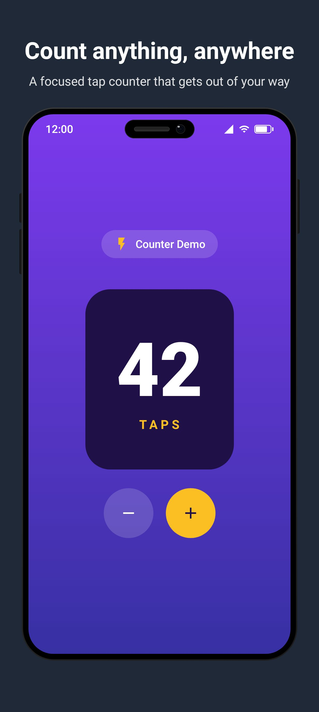 | 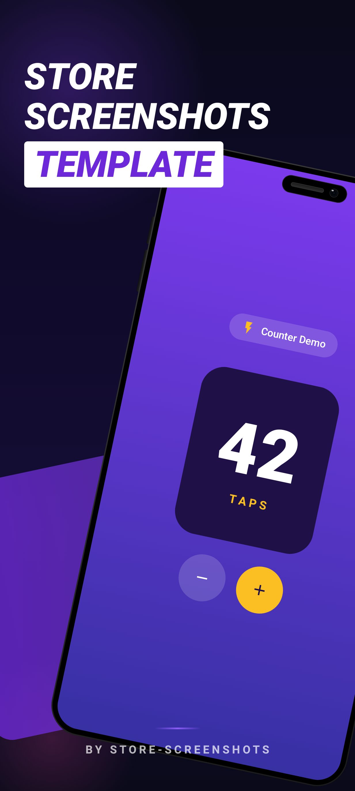 | 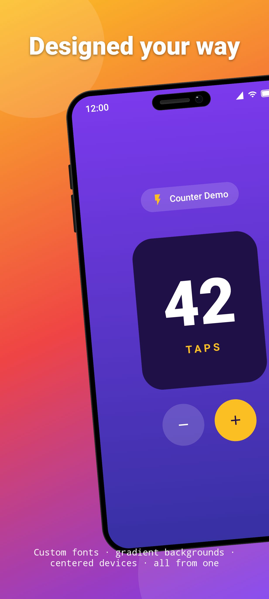 | 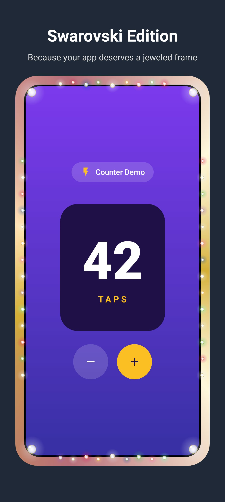 |
| Phone | Custom layout | Styled | Custom frame |
| 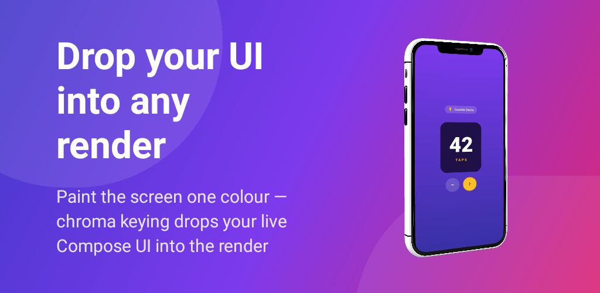 | | 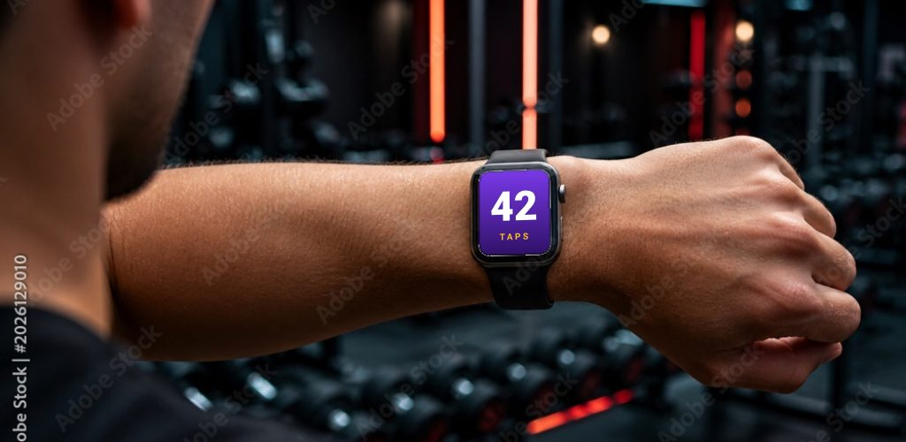 | |
| Live UI on a 3D render | | Live UI on a real photo | |

Gradle plugin + Compose library for generating framed Play Store / App Store screenshots from Compose UI under Robolectric.

## What it gives you

- A `screenshot()` function that renders your composable inside a device frame at the exact pixel size each store expects
- Localized titles via `R.string.*` resource IDs — one PNG per locale, automatic
- A `screenshots` source set (auto-created by the plugin) so screenshot code lives separately from regular tests
- Per-form-factor `@Preview` annotations for pixel-identical IDE previews
- A `ScreenshotPreview` composable so previews match generated PNGs

## Quick start

### Option A — Maven Central (released versions)

The plugin and library are published to Maven Central, so no authentication is required. In your `settings.gradle.kts`, make sure `mavenCentral()` is listed for both plugins and dependencies:

```kotlin
pluginManagement {
    repositories {
        gradlePluginPortal()
        google()
        mavenCentral()
    }
    plugins {
        id("io.github.lucianosantosdev.storescreenshots") version "1.0.0"
    }
}

dependencyResolutionManagement {
    repositories {
        google()
        mavenCentral()
    }
}
```

The plugin resolves its runtime library (`io.github.lucianosantosdev:storescreenshots-library`) automatically — you only declare the plugin id.

### Option B — Composite build (local development)

```kotlin
pluginManagement {
    includeBuild("path/to/store-screenshots/plugin")
}
includeBuild("path/to/store-screenshots")
```

`mobile/build.gradle.kts`:

```kotlin
plugins {
    id("io.github.lucianosantosdev.storescreenshots")
}
```

`mobile/src/screenshots/kotlin/.../MyScreenshots.kt`:

```kotlin
class MyScreenshots : StoreScreenshotsTest(FormFactor.Phone) {

    @Test fun settings() = screenshot(
        locales = listOf("en-US", "pt-BR"),
        titleRes = R.string.screenshot_settings_title,
        descriptionRes = R.string.screenshot_settings_desc,
    ) { MySettingsScreen() }
}
```

`StoreScreenshotsTest` bundles `@RunWith(RobolectricTestRunner)`, `@GraphicsMode(NATIVE)`, `@Config(sdk = [35], application = StoreScreenshotsStubApplication)`, and a `@get:Rule ScreenshotRule`.

Run with:

```
./gradlew :mobile:storeScreenshots
```

## screenshot() parameters

Everything is driven by the `screenshot()` function — no annotations needed beyond `@Test`:

```kotlin
@Test fun home() = screenshot(
    locales = listOf("en-US", "pt-BR"),   // one PNG per locale (default: en-US)
    titleRes = R.string.screenshot_title,  // resolved per locale automatically
    descriptionRes = R.string.screenshot_desc,
    backgroundColor = Color(0xFF1F2937),  // banner background
    contentColor = Color.White,           // banner text color
    fileName = "01_home",                 // PNG name (default: test method name)
    style = ScreenshotStyle(...),         // advanced styling (optional)
) { HomeScreen() }
```

| Parameter | Purpose |
| --- | --- |
| `locales` | BCP-47 tags — one PNG per entry. Default `listOf("en-US")`. |
| `title` / `description` | Raw string headline/sub-headline. |
| `titleRes` / `descriptionRes` | `R.string.*` resource ID, resolved per locale. Takes precedence over raw strings. |
| `backgroundColor` | Banner background color. Default dark gray. |
| `contentColor` | Banner text color. Default white. |
| `fileName` | Output PNG name (without the locale path). Defaults to the test method name. `.png` is appended if omitted. Useful to control ordering in the store (e.g. `"01_home"`). |
| `style` | `ScreenshotStyle` for advanced customization. |

## Custom output directory

By default, screenshots land in `build/outputs/store-screenshots/{locale}/images/{subdir}/`. To write into Fastlane's layout:

```kotlin
storeScreenshots {
    destDir = rootProject.layout.projectDirectory.dir("fastlane/metadata/android")
    // → fastlane/metadata/android/{locale}/images/phoneScreenshots/*.png
}
```

## Supported form factors

| FormFactor | Output size | Subdir |
| --- | --- | --- |
| `Phone` | 1080 x 1920 | `phoneScreenshots` |
| `Wear` | 384 x 384 | `wearScreenshots` |
| `Tablet7` | 1200 x 1920 | `sevenInchScreenshots` |
| `Tablet10` | 1600 x 2560 | `tenInchScreenshots` |
| `AppleIPhone67` | 1290 x 2796 | `iphone67` |
| `GooglePlayFeatureGraphic` | 1024 x 500 | `featureGraphic` |

### Feature graphic

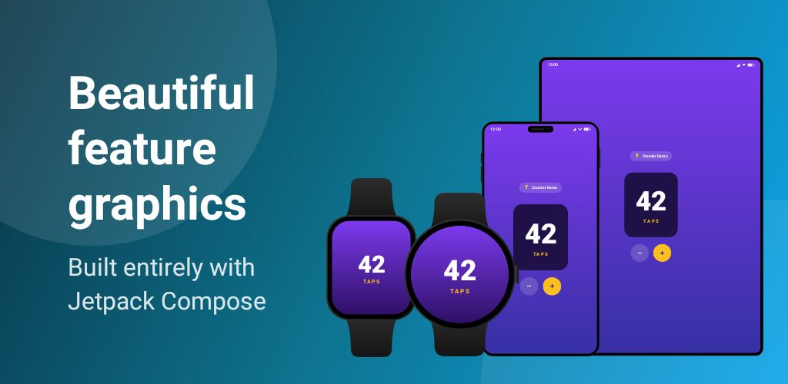

`GooglePlayFeatureGraphic` is the landscape 1024 x 500 banner shown at the top of a Play Store
listing. Unlike the other form factors it has no built-in title/description frame — a feature
graphic is promotional art, so you compose it yourself with `customScreenshot { … }` and drop a
`DeviceMockup(formFactor = …)` for each device your app supports. Each mockup is laid out at its
native size and uniformly scaled to fit, so the bezel, status bar, and content keep real-device
proportions no matter how small you draw it. Size it with the `Modifier` you pass — bound the
height to line several devices up. Calling `screenshot(…)` on this form factor throws — use
`customScreenshot`.

For watches, `DeviceMockup(FormFactor.Wear)` draws a round case; use `WatchMockup(shape = …)`
directly to choose `WatchShape.Round` or `WatchShape.Square`.

The banner above is generated by [`FeatureGraphicBanner`](example/src/main/kotlin/dev/lucianosantos/storescreenshots/example/FeatureGraphicBanner.kt):

```kotlin
class FeatureGraphic : StoreScreenshotsTest(FormFactor.GooglePlayFeatureGraphic) {
    @Test fun banner() = customScreenshot(locales = listOf("en-US", "pt-BR")) { FeatureGraphicBanner() }
}

@Composable
fun FeatureGraphicBanner() {
    Box(
        Modifier.fillMaxSize().background(
            Brush.linearGradient(listOf(Color(0xFF083344), Color(0xFF0E7490), Color(0xFF0EA5E9)))
        )
    ) {
        Row(Modifier.fillMaxSize(), verticalAlignment = Alignment.CenterVertically) {
            // Marketing copy on the left.
            Column(Modifier.weight(1f).padding(start = 44.dp, end = 16.dp)) {
                Text("Beautiful feature graphics", color = Color.White, fontSize = 30.sp, fontWeight = FontWeight.Bold)
                Spacer(Modifier.height(12.dp))
                Text("Built entirely with Jetpack Compose", color = Color.White.copy(alpha = 0.85f), fontSize = 16.sp)
            }
            // Device family, ascending in size on a shared baseline; drawn back-to-front.
            Box(Modifier.weight(1.45f).fillMaxHeight().padding(end = 16.dp, bottom = 18.dp)) {
                DeviceMockup(FormFactor.Tablet10, Modifier.fillMaxHeight(0.84f).align(Alignment.BottomEnd)) { HomeScreen() }
                DeviceMockup(FormFactor.Phone, Modifier.fillMaxHeight(0.66f).align(Alignment.BottomStart).offset(x = 104.dp)) { HomeScreen() }
                WatchMockup(WatchShape.Square, Modifier.fillMaxHeight(0.5f).align(Alignment.BottomStart)) { WatchScreen() }
                WatchMockup(WatchShape.Round, Modifier.fillMaxHeight(0.46f).align(Alignment.BottomStart).offset(x = 50.dp)) { WatchScreen() }
            }
        }
    }
}
```

## Styling

Pass a `ScreenshotStyle` to `StoreScreenshotsTest` (class-level default) or to `screenshot(style = …)` (per-method override):

```kotlin
@Test fun home() = screenshot(
    titleRes = R.string.screenshot_title,
    style = ScreenshotStyle(
        mockupPosition = MockupPosition.Middle,
        mockupOffset = DpOffset(x = 24.dp, y = 32.dp),
        showStatusBar = true,
        statusBarClock = "9:41",
        titleFontFamily = FontFamily.Serif,
        descriptionFontFamily = FontFamily.Monospace,
        background = { MyGradientBackground() },
        title = { text -> MyStyledTitle(text) },
        description = { text -> MyStyledDescription(text) },
    ),
) { HomeScreen() }
```

| Option | Purpose |
| --- | --- |
| `mockupPosition` | Device frame at `Top`, `Middle`, or `Bottom` (default). |
| `mockupOffset` | `DpOffset(x, y)` — X crops off the canvas edge, Y reserves layout space so text doesn't overlap. |
| `mockupRotation` | In-plane Z rotation in degrees (the flat `Modifier.rotate` spin). |
| `mockupRotationX` / `mockupRotationY` | 3D perspective tilt in degrees — X tips the device toward/away, Y turns it left/right. See [3D perspective](#3d-perspective). |
| `mockupCameraDistance` | Perspective strength for the 3D tilt. Higher = flatter, lower = more dramatic. Default `12`. |
| `showStatusBar` | Show/hide the status bar on phone, tablet, and Apple mockups. Default `true`. |
| `statusBarClock` | Clock text in the status bar. Default `"12:00"`. |
| `titleFontFamily` / `descriptionFontFamily` | Font for the default title/description Text composables. |
| `background` | Composable rendered behind everything. Overrides `backgroundColor`. |
| `mockupFrame` | Composable that replaces the built-in device bezel entirely. Receives app content as a parameter. |
| `title` / `description` | Full composable control over banner text rendering. |

## Custom device frame

Replace the built-in device bezel with your own composable via `mockupFrame`. Title/description/positioning still work — only the device shape changes:


```kotlin
@Test fun home() = screenshot(
    title = "My app",
    style = ScreenshotStyle(
        mockupFrame = { content ->
            // Your custom bezel — draw anything, put content() inside
            Box(
                Modifier.fillMaxWidth().aspectRatio(9f / 16f)
                    .clip(RoundedCornerShape(32.dp))
                    .border(4.dp, Color.Cyan, RoundedCornerShape(32.dp))
                    .background(Color.Black)
            ) { content() }
        },
    ),
) { HomeScreen() }
```

## Fully custom layout

For complete control, use `customScreenshot {}`. You get a `ScreenshotScope` with a `Mockup {}` composable that renders just the device bezel — everything else is yours:


```kotlin
// Shared layout in src/main/ (used by both test and preview)
@Composable
fun CustomScreenshotLayout(mockup: @Composable () -> Unit) {
    Box(Modifier.fillMaxSize().background(Color(0xFF0A0A0F))) {
        // Layer 1: diagonal purple stripe
        Box(Modifier.fillMaxWidth().height(300.dp).offset(x = (-40).dp, y = 520.dp)
            .rotate(-12f).background(Brush.horizontalGradient(
                listOf(Color(0xFF6D28D9), Color(0xFF7C3AED), Color(0xFF8B5CF6)))))
        // Layer 2: rotated device mockup
        Box(Modifier.align(Alignment.CenterEnd).fillMaxWidth(0.85f)
            .offset(x = 60.dp, y = 80.dp).rotate(12f)) { mockup() }
        // Layer 3: text on top
        Column(Modifier.fillMaxSize().padding(28.dp).padding(top = 36.dp, bottom = 12.dp)) {
            Text("STORE\nSCREENSHOTS", color = Color.White, fontSize = 42.sp,
                fontWeight = FontWeight.Black, fontStyle = FontStyle.Italic)
            Text("TEMPLATE", Modifier.background(Color.White).padding(horizontal = 12.dp),
                color = Color(0xFF8B5CF6), fontSize = 42.sp, fontWeight = FontWeight.Black)
            Spacer(Modifier.weight(1f))
            Text("BY STORE-SCREENSHOTS", Modifier.align(Alignment.CenterHorizontally),
                color = Color.White, fontSize = 13.sp, letterSpacing = 3.sp)
        }
    }
}

// Test — src/screenshots/
@Test fun custom_layout() = customScreenshot {
    CustomScreenshotLayout { Mockup { CounterScreen(count = 42) } }
}

// Preview — src/debug/
@PhoneScreenshotPreview
@Composable
fun CustomLayoutPreview() = CustomScreenshotLayout {
    DeviceMockup(FormFactor.Phone) { CounterScreen(count = 42) }
}
```

## Previews

Per-form-factor `@Preview` annotations bundle the right `widthDp`/`heightDp`:

```kotlin
// src/debug/ — Android Studio renders these
@PhoneScreenshotPreview
@Composable
fun HomePreview() = ScreenshotPreview(
    formFactor = FormFactor.Phone,
    title = "Welcome home",
    description = "Sign in to get started",
) { HomeScreen() }
```

| Annotation | Dimensions |
| --- | --- |
| `@PhoneScreenshotPreview` | 411 x 914 dp |
| `@WearScreenshotPreview` | 227 x 227 dp |
| `@Tablet7ScreenshotPreview` | 600 x 960 dp |
| `@Tablet10ScreenshotPreview` | 800 x 1280 dp |
| `@AppleIPhone67ScreenshotPreview` | 430 x 932 dp |
| `@AllScreenshotPreviews` | All five at once |

Previews go in `src/debug/` (Studio only renders debug variant). Tests go in `src/screenshots/`. Shared composables go in `src/main/`.

## Examples

The [`example/`](example) module generates screenshots from the same `CounterScreen` composable. Source: `example/src/screenshots/kotlin/`.

### Mockup positions

`MockupPosition.Top` / `Middle` / `Bottom` — controls where the device sits relative to the title and description.

#### Phone

| Top | Middle | Bottom (default) |
| :---: | :---: | :---: |
| 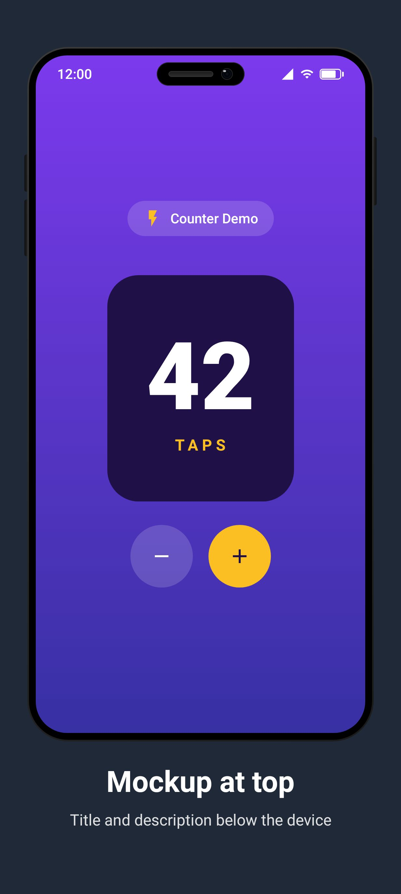 | 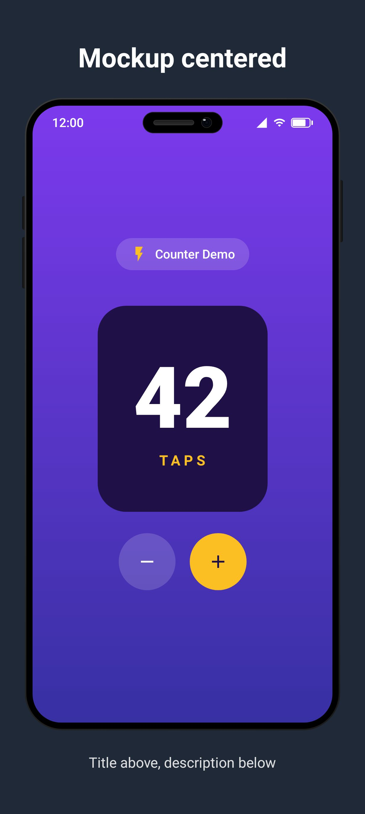 |  |

#### 7-inch tablet

| Top | Middle | Bottom (default) |
| :---: | :---: | :---: |
| 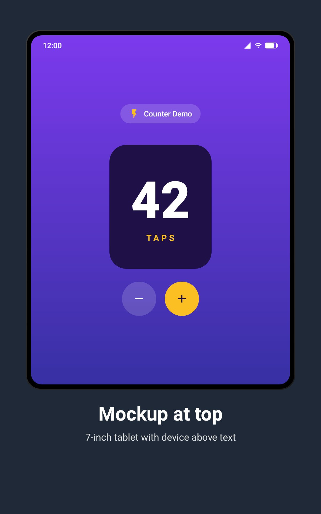 |  | 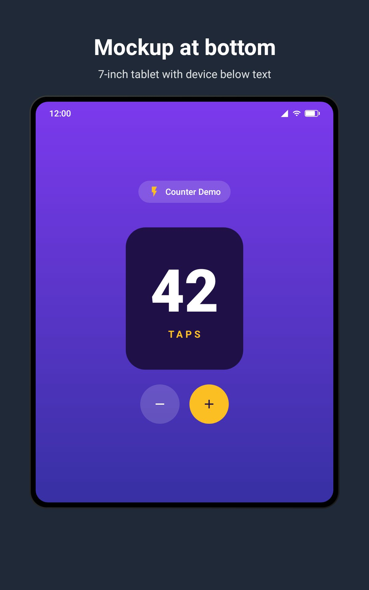 |

#### 10-inch tablet

| Top | Middle | Bottom (default) |
| :---: | :---: | :---: |
| 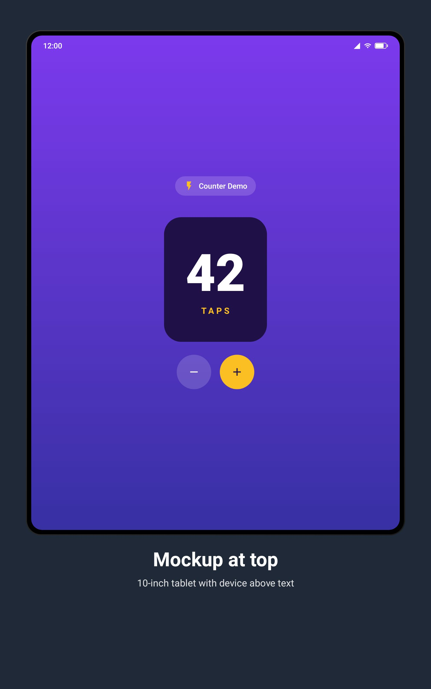 |  | 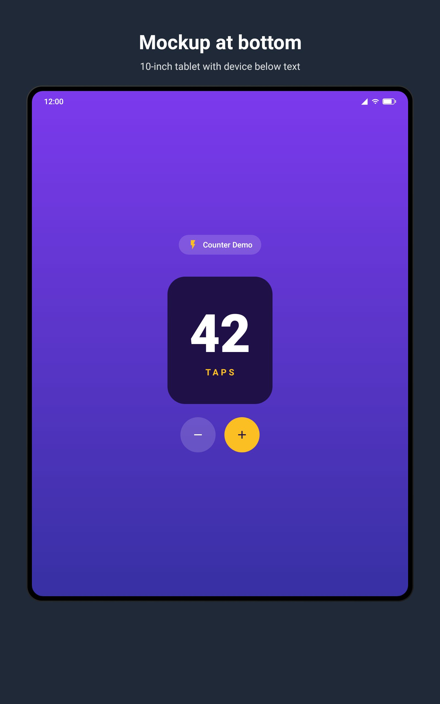 |

#### Apple iPhone 6.7"

| Top | Middle | Bottom (default) |
| :---: | :---: | :---: |
| 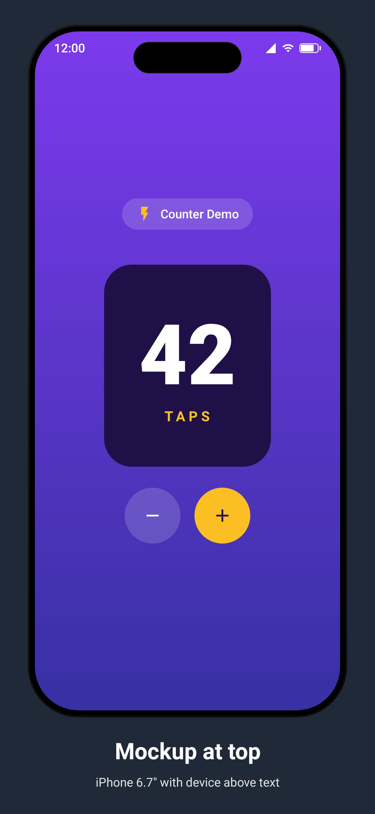 | 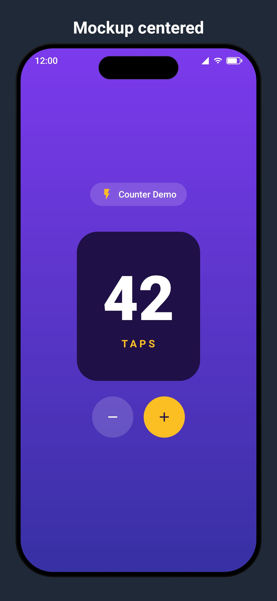 |  |

```kotlin
// One line to change the position:
@Test fun home_top() = screenshot(
    title = "Mockup at top",
    description = "Title and description below the device",
    style = ScreenshotStyle(mockupPosition = MockupPosition.Top),
) { HomeScreen() }
```

### Wear OS

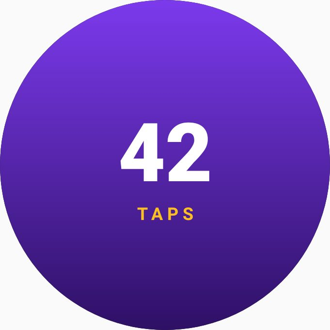

Wear screenshots have no title/description banner, so `mockupPosition` doesn't apply.

### Custom style (composable background + title + description)


```kotlin
@Test fun counter_styled() = screenshot(
    titleRes = R.string.screenshot_styled_title,
    descriptionRes = R.string.screenshot_styled_desc,
    style = ScreenshotStyle(
        mockupPosition = MockupPosition.Middle,
        mockupOffset = DpOffset(x = 100.dp, y = 32.dp),
        mockupRotation = -5f,
        background = { MarketingBackground() },
        title = { text -> StyledTitle(text) },
        description = { text -> StyledDescription(text) },
    ),
) { CounterScreen(count = 42) }
```

### 3D perspective

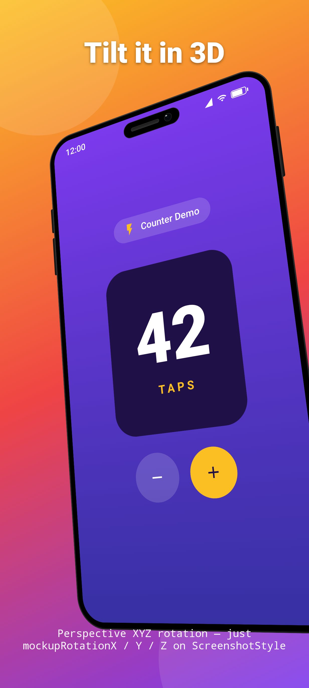

Tilt the device in 3D for a marketing hero shot. `mockupRotationX` tips it toward or away from
the viewer, `mockupRotationY` turns it left/right, and `mockupRotation` spins it in-plane (Z).
It's a pure Compose `graphicsLayer` perspective transform — no extra dependency — so it renders
into the PNG exactly as it previews. Tune `mockupCameraDistance` if a steep angle looks too warped
(higher) or too flat (lower):

```kotlin
@Test fun counter_perspective() = screenshot(
    titleRes = R.string.screenshot_perspective_title,
    descriptionRes = R.string.screenshot_perspective_desc,
    style = ScreenshotStyle(
        mockupPosition = MockupPosition.Middle,
        mockupRotationY = -26f,  // turn left edge toward the viewer
        mockupRotationX = 8f,    // tip the top back a little
        mockupRotation = -6f,    // slight in-plane spin
        background = { MarketingBackground() },
    ),
) { CounterScreen(count = 42) }
```

The same `rotationX` / `rotationY` / `rotationZ` / `cameraDistance` parameters exist on
`DeviceMockup`, `WatchMockup`, and the `Mockup { }` composable, so you can tilt individual devices
inside a `customScreenshot { }` layout or a feature graphic too.

## Device image mockup (use a 3D render / photo)

Drop your live Compose UI into the empty screen of a real device image — a 3D render or a photo —
with correct perspective. You pass the image plus one composable per screen; the screens are found
automatically, and your UI fills each one (the device's own bezel does the cropping).

| | |
| :---: | :---: |
| 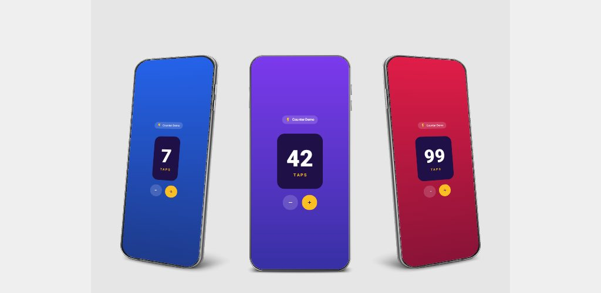<br>Three phones | 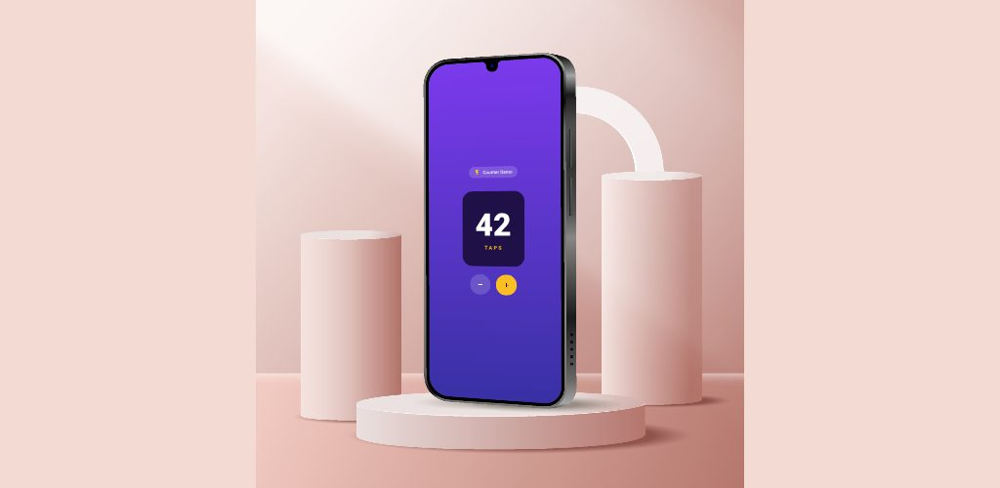<br>Gray screen |
| 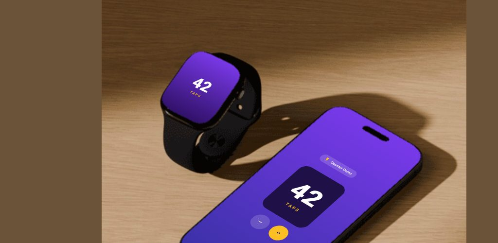<br>Watch + phone | 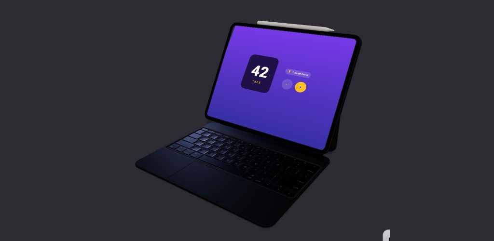<br>Tablet |
| <br>Chroma-keyed on a transparent render | <br>Chroma-keyed on a real photo |
| 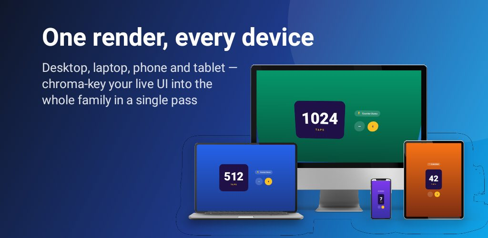<br>Chroma-keyed device family (desktop, laptop, phone, tablet) | |

### Usage

```kotlin
@Test fun home() = customScreenshot {
    DeviceImageMockup(
        frame = frame("three_phones.jpg"),
        screens = listOf(Screen { HomeScreen() }, Screen { SettingsScreen() }, Screen { ProfileScreen() }), // left → right
    )
}
```

Each `Screen` is matched to the detected screens left-to-right (pass one for a single-device render).
Size and place the mockup with the `modifier` — `Modifier.fillMaxHeight()` fits it inside the canvas,
and you can zoom or reframe it with ordinary modifiers, e.g. `Modifier.fillMaxHeight().scale(1.5f).offset(x = 24.dp, y = 36.dp)`.

A `Screen` optionally takes a device `kind` and a manual `rotation`. The `kind` (`Watch`, `Phone`,
`Tablet`, `Laptop`, `Desktop`) sets the screen's orientation and the width its UI is laid out at — useful
for a mixed device family where geometry alone can't tell a sideways watch from a small landscape screen.
The `rotation` adds a manual quarter-turn on top:

```kotlin
screens = listOf(
    Screen(DeviceKind.Desktop) { HomeScreen() },                          // landscape, laid out large
    Screen(DeviceKind.Watch, rotation = ScreenRotation.Clockwise90) { WatchFace() },
)
```

### Where to put the frame image

The frame is only needed while generating screenshots, so keep it **out of your app**: put it in the
`screenshots` source set's `resources` and load it from the classpath — it never ships in your APK.

```
mobile/src/screenshots/resources/mockups/three_phones.jpg
```

```kotlin
private fun frame(name: String): ImageBitmap =
    javaClass.classLoader!!.getResourceAsStream("mockups/$name").use {
        BitmapFactory.decodeStream(it).asImageBitmap()  // android.graphics.BitmapFactory
    }
```

(You could instead use `ImageBitmap.imageResource(R.drawable.…)`, but then the image has to live in
`src/main/res/drawable/` and **does** ship in your app.)

### Chroma-key the screen (most robust)

Auto-detection expects a dark bezel to wall the screen off from the background, which fails for a
white screen on a white backdrop or a bezel-less render. If you control the render, the easiest fix
is to **paint each empty screen a flat, distinctive colour** — a green or magenta that appears
nowhere else — and pass it as `screenColor`. Detection then locks onto that colour and ignores the
bezel, body and background entirely (each connected blob of the colour becomes one screen):

```kotlin
DeviceImageMockup(
    frame = frame("phone_green_screen.png"),
    screens = listOf(Screen { HomeScreen() }),
    screenColor = Color(0xFF00C85A),   // the colour you painted the screen
    screenColorTolerance = 0.22f,      // widen if JPEG softened the colour, tighten if it leaks
)
```

Export the render with a **transparent background** (PNG or WebP) and the device drops straight onto
whatever you compose behind it — a gradient, marketing copy, anything — since only the device pixels
are drawn. That's how the example above places the phone on a colourful feature-graphic banner.

### When auto-detection can't find the screen

Without a chroma colour it expects a dark-bezel device on a plain background. For a light/silver
body, a dark or busy background, or overlapping graphics, give the four screen corners yourself
(fractions `0..1` of the image, top-left, top-right, bottom-right, bottom-left — read them off the
image once in any editor):

```kotlin
DeviceImageMockup(frame, Offset(0.18f, 0.07f), Offset(0.86f, 0.13f), Offset(0.79f, 0.94f), Offset(0.12f, 0.88f)) {
    HomeScreen()
}
```

Vector files (`.eps`, `.ai`, `.svg`) must be rasterized to PNG/WebP first — Compose only loads raster images.

## Releasing

Push a tag matching `v[0-9]+.[0-9]+.[0-9]+` (e.g. `v0.2.0`). The release workflow publishes to Maven Central and GitHub Packages.

## License

MIT — see [LICENSE](LICENSE).
