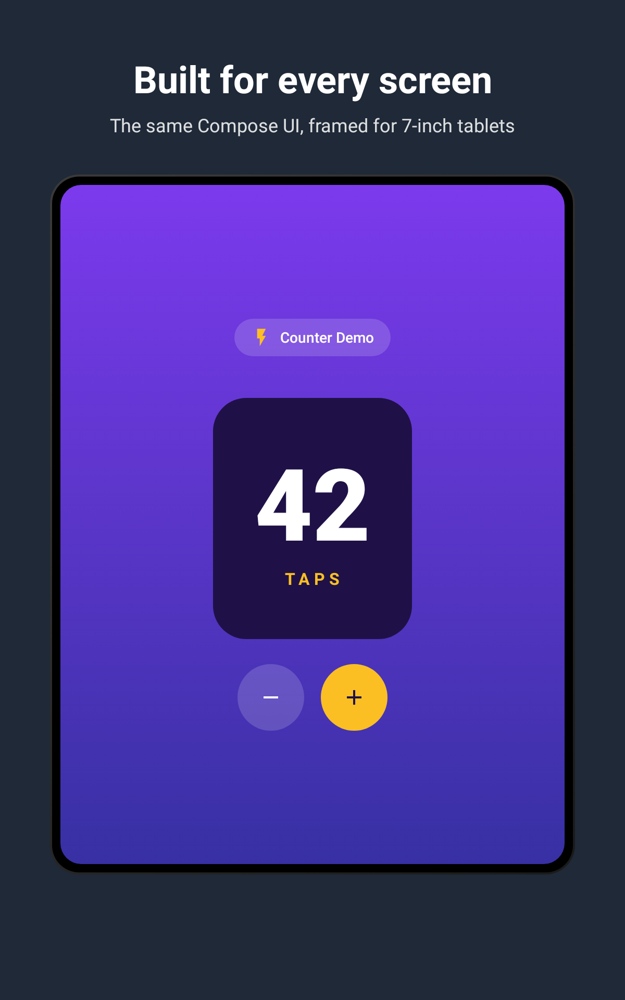
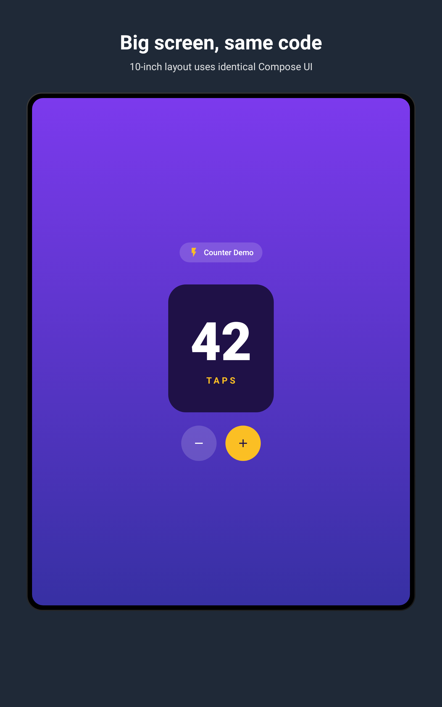
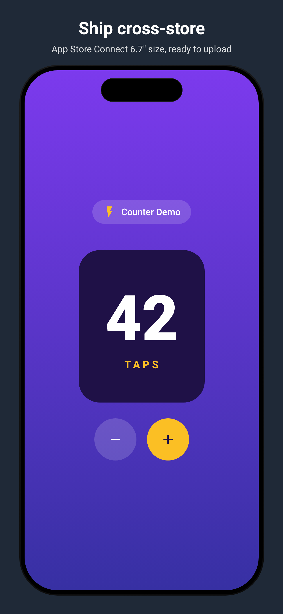

# store-screenshots

Gradle plugin + Compose library for generating framed Play Store / App Store screenshots from Compose UI under Robolectric.

## What it gives you

- An `@Screenshot(locales = [...], title = "...", description = "...")` annotation
- A `ScreenshotRule` JUnit rule that renders your composable inside a device frame at the exact pixel size each store expects
- A `screenshots` source set (auto-created by the plugin) so screenshot code lives separately from regular tests
- Output written directly into the Fastlane metadata layout

## Quick start

### Option A — GitHub Packages (released versions)

GitHub Packages always requires authentication, even for public packages. Add a personal-access token with `read:packages` scope to `~/.gradle/gradle.properties`:

```properties
gpr.user=your-github-username
gpr.token=ghp_xxx
```

Then in your `settings.gradle.kts`:

```kotlin
pluginManagement {
    repositories {
        gradlePluginPortal()
        google()
        mavenCentral()
        maven {
            url = uri("https://maven.pkg.github.com/lucianosantosdev/store-screenshots")
            credentials {
                username = providers.gradleProperty("gpr.user").get()
                password = providers.gradleProperty("gpr.token").get()
            }
        }
    }
    plugins {
        id("dev.lucianosantos.storescreenshots") version "0.1.0"
    }
}

dependencyResolutionManagement {
    repositories {
        google()
        mavenCentral()
        maven {
            url = uri("https://maven.pkg.github.com/lucianosantosdev/store-screenshots")
            credentials {
                username = providers.gradleProperty("gpr.user").get()
                password = providers.gradleProperty("gpr.token").get()
            }
        }
    }
}
```

### Option B — Composite build (local development)

```kotlin
pluginManagement {
    includeBuild("path/to/store-screenshots")
}
includeBuild("path/to/store-screenshots")
```

`mobile/build.gradle.kts`:

```kotlin
plugins {
    id("dev.lucianosantos.storescreenshots")
}
```

`mobile/src/screenshots/kotlin/.../MyScreenshots.kt`:

```kotlin
@RunWith(RobolectricTestRunner::class)
class MyScreenshots {
    @get:Rule val screenshot = ScreenshotRule(FormFactor.Phone)

    @Test
    @Screenshot(
        locales = ["en-US", "pt-BR"],
        title = "Set up your workout",
        description = "Pick sections, train and rest times",
        backgroundColor = 0xFF1F2937,
    )
    fun settings() = screenshot.capture {
        MySettingsScreen()
    }
}
```

Run with:

```
./gradlew :mobile:storeScreenshots
```

Output lands at `fastlane/metadata/android/{locale}/images/{phone|wear|sevenInch|tenInch}Screenshots/`.

## Custom output directory

By default, screenshots are written under the **root project** directory so they land alongside `fastlane/`. Override with the `storeScreenshots {}` extension:

```kotlin
storeScreenshots {
    destDir = layout.projectDirectory.dir("custom/output")
}
```

The Fastlane subdirectory layout (`{locale}/images/phoneScreenshots/`, etc.) is always preserved beneath whatever you set.

## Supported form factors

| FormFactor | Output size | Fastlane dir |
| --- | --- | --- |
| `Phone` | 1080 x 1920 | `phoneScreenshots` |
| `Wear` | 384 x 384 | `wearScreenshots` |
| `Tablet7` | 1200 x 1920 | `sevenInchScreenshots` |
| `Tablet10` | 1600 x 2560 | `tenInchScreenshots` |
| `AppleIPhone67` | 1290 x 2796 | `fastlane/screenshots/{locale}/iphone67` |

## Examples

The [`example/`](example) module generates one screenshot per form factor from the same `CounterScreen` composable. Source code is under `example/src/screenshots/kotlin/`.

Run all of them with:

```
./gradlew :example:storeScreenshots
```

### Phone


```kotlin
@RunWith(RobolectricTestRunner::class)
@Config(sdk = [35], application = StubApplication::class)
class PhoneExampleTest {
    @get:Rule val screenshot = ScreenshotRule(FormFactor.Phone)

    @Test
    @Screenshot(
        title = "Count anything, anywhere",
        description = "A focused tap counter that gets out of your way",
    )
    fun counter() = screenshot.capture {
        CounterScreen(count = 42)
    }
}
```

### Wear OS


```kotlin
@RunWith(RobolectricTestRunner::class)
@Config(sdk = [35], application = StubApplication::class)
class WearExampleTest {
    @get:Rule val screenshot = ScreenshotRule(FormFactor.Wear)

    @Test
    @Screenshot(backgroundColor = 0xFF000000)
    fun counter() = screenshot.capture {
        WearCounterScreen(count = 42)
    }
}
```

### 7-inch tablet



```kotlin
@RunWith(RobolectricTestRunner::class)
@Config(sdk = [35], application = StubApplication::class)
class Tablet7ExampleTest {
    @get:Rule val screenshot = ScreenshotRule(FormFactor.Tablet7)

    @Test
    @Screenshot(
        title = "Built for every screen",
        description = "The same Compose UI, framed for 7-inch tablets",
    )
    fun counter() = screenshot.capture {
        CounterScreen(count = 42)
    }
}
```

### 10-inch tablet



```kotlin
@RunWith(RobolectricTestRunner::class)
@Config(sdk = [35], application = StubApplication::class)
class Tablet10ExampleTest {
    @get:Rule val screenshot = ScreenshotRule(FormFactor.Tablet10)

    @Test
    @Screenshot(
        title = "Big screen, same code",
        description = "10-inch layout uses identical Compose UI",
    )
    fun counter() = screenshot.capture {
        CounterScreen(count = 42)
    }
}
```

### Apple App Store (iPhone 6.7")



```kotlin
@RunWith(RobolectricTestRunner::class)
@Config(sdk = [35], application = StubApplication::class)
class AppleExampleTest {
    @get:Rule val screenshot = ScreenshotRule(FormFactor.AppleIPhone67)

    @Test
    @Screenshot(
        title = "Ship cross-store",
        description = "App Store Connect 6.7\" size, ready to upload",
    )
    fun counter() = screenshot.capture {
        CounterScreen(count = 42)
    }
}
```

## Releasing

Push a tag matching `v[0-9]+.[0-9]+.[0-9]+` (e.g. `v0.2.0`). The release workflow builds and publishes the library, plugin, and plugin marker artifact to GitHub Packages.

## License

MIT — see [LICENSE](LICENSE).

## Status

Pre-1.0. Used by the [Interval Timer](https://github.com/lucianosantosdev/IntervalTimer) app.
