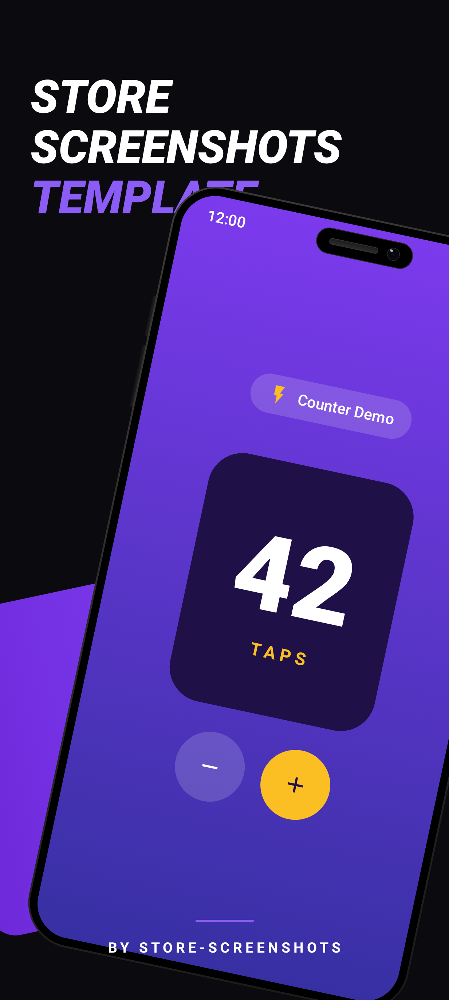
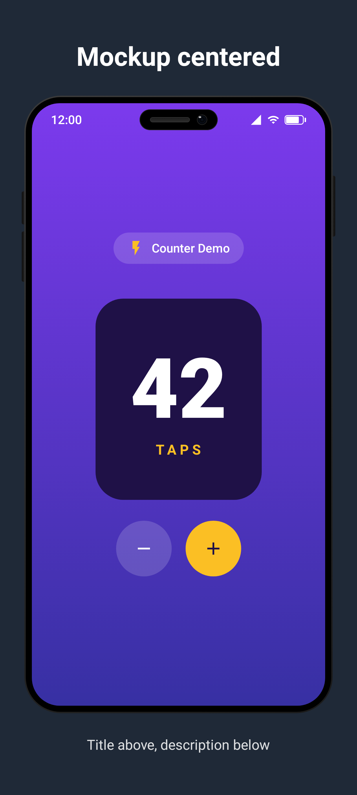
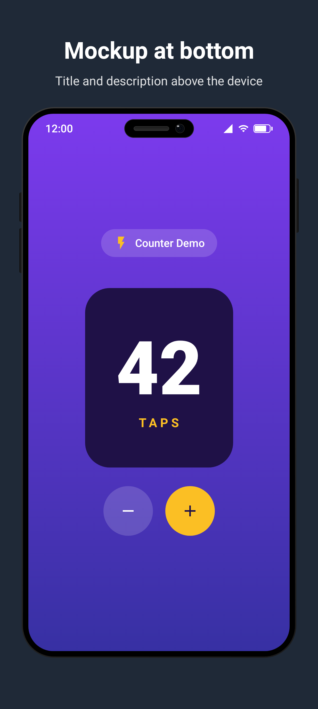
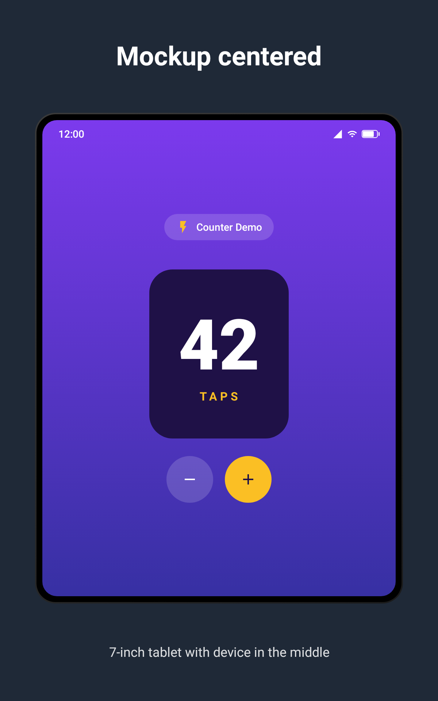
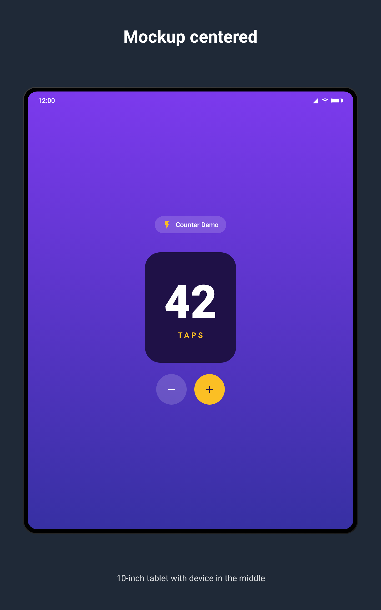
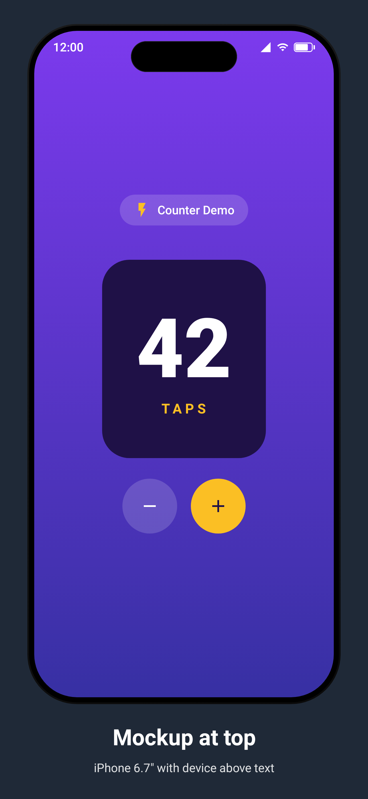
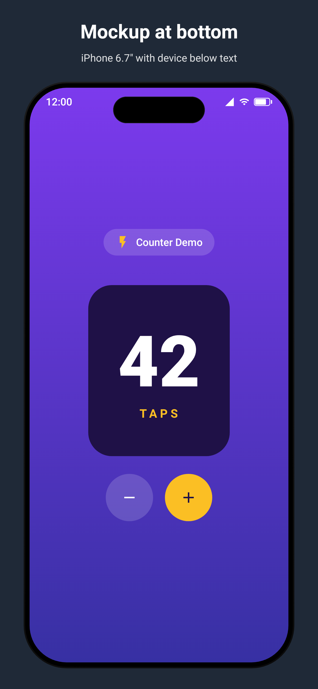
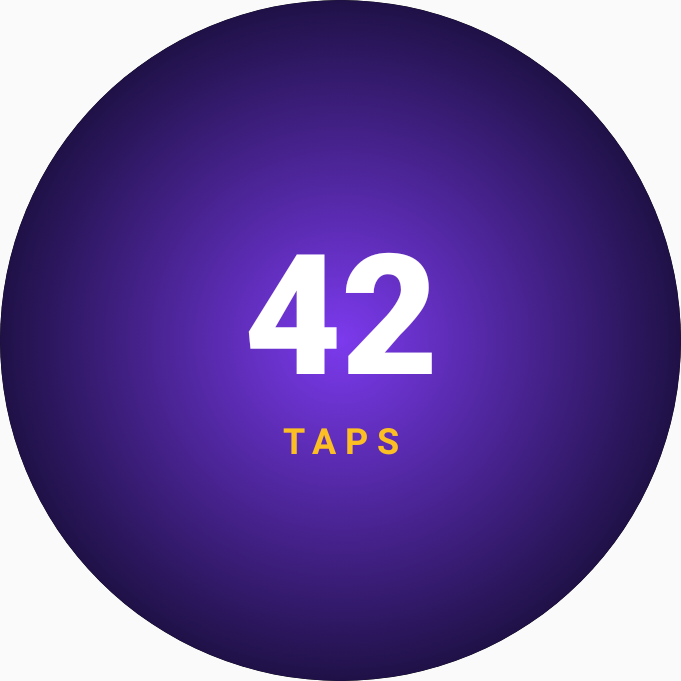
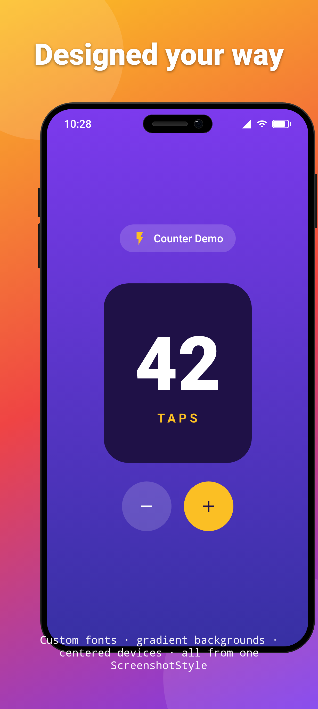

# store-screenshots

Gradle plugin + Compose library for generating framed Play Store / App Store screenshots from Compose UI under Robolectric.

## What it gives you

- A `screenshot()` function that renders your composable inside a device frame at the exact pixel size each store expects
- Localized titles via `R.string.*` resource IDs — one PNG per locale, automatic
- A `screenshots` source set (auto-created by the plugin) so screenshot code lives separately from regular tests
- Per-form-factor `@Preview` annotations for pixel-identical IDE previews
- A `ScreenshotPreview` composable so previews match generated PNGs

## Quick start

### Option A — GitHub Packages (released versions)

GitHub Packages requires authentication. Add a personal-access token with `read:packages` scope to `~/.gradle/gradle.properties`:

```properties
gpr.user=your-github-username
gpr.token=ghp_xxx
```

Then in your `settings.gradle.kts`:

```kotlin
pluginManagement {
    repositories {
        gradlePluginPortal()
        google()
        mavenCentral()
        maven {
            url = uri("https://maven.pkg.github.com/lucianosantosdev/store-screenshots")
            credentials {
                username = providers.gradleProperty("gpr.user").get()
                password = providers.gradleProperty("gpr.token").get()
            }
        }
    }
    plugins {
        id("dev.lucianosantos.storescreenshots") version "0.1.0"
    }
}

dependencyResolutionManagement {
    repositories {
        google()
        mavenCentral()
        maven {
            url = uri("https://maven.pkg.github.com/lucianosantosdev/store-screenshots")
            credentials {
                username = providers.gradleProperty("gpr.user").get()
                password = providers.gradleProperty("gpr.token").get()
            }
        }
    }
}
```

### Option B — Composite build (local development)

```kotlin
pluginManagement {
    includeBuild("path/to/store-screenshots/plugin")
}
includeBuild("path/to/store-screenshots")
```

`mobile/build.gradle.kts`:

```kotlin
plugins {
    id("dev.lucianosantos.storescreenshots")
}
```

`mobile/src/screenshots/kotlin/.../MyScreenshots.kt`:

```kotlin
class MyScreenshots : StoreScreenshotsTest(FormFactor.Phone) {

    @Test fun settings() = screenshot(
        locales = listOf("en-US", "pt-BR"),
        titleRes = R.string.screenshot_settings_title,
        descriptionRes = R.string.screenshot_settings_desc,
    ) { MySettingsScreen() }
}
```

`StoreScreenshotsTest` bundles `@RunWith(RobolectricTestRunner)`, `@GraphicsMode(NATIVE)`, `@Config(sdk = [35], application = StoreScreenshotsStubApplication)`, and a `@get:Rule ScreenshotRule`.

Run with:

```
./gradlew :mobile:storeScreenshots
```

## screenshot() parameters

Everything is driven by the `screenshot()` function — no annotations needed beyond `@Test`:

```kotlin
@Test fun home() = screenshot(
    locales = listOf("en-US", "pt-BR"),   // one PNG per locale (default: en-US)
    titleRes = R.string.screenshot_title,  // resolved per locale automatically
    descriptionRes = R.string.screenshot_desc,
    backgroundColor = Color(0xFF1F2937),  // banner background
    contentColor = Color.White,           // banner text color
    style = ScreenshotStyle(...),         // advanced styling (optional)
) { HomeScreen() }
```

| Parameter | Purpose |
| --- | --- |
| `locales` | BCP-47 tags — one PNG per entry. Default `listOf("en-US")`. |
| `title` / `description` | Raw string headline/sub-headline. |
| `titleRes` / `descriptionRes` | `R.string.*` resource ID, resolved per locale. Takes precedence over raw strings. |
| `backgroundColor` | Banner background color. Default dark gray. |
| `contentColor` | Banner text color. Default white. |
| `style` | `ScreenshotStyle` for advanced customization. |

## Custom output directory

By default, screenshots land in `build/outputs/store-screenshots/{locale}/images/{subdir}/`. To write into Fastlane's layout:

```kotlin
storeScreenshots {
    destDir = rootProject.layout.projectDirectory.dir("fastlane/metadata/android")
    // → fastlane/metadata/android/{locale}/images/phoneScreenshots/*.png
}
```

## Supported form factors

| FormFactor | Output size | Subdir |
| --- | --- | --- |
| `Phone` | 1080 x 1920 | `phoneScreenshots` |
| `Wear` | 384 x 384 | `wearScreenshots` |
| `Tablet7` | 1200 x 1920 | `sevenInchScreenshots` |
| `Tablet10` | 1600 x 2560 | `tenInchScreenshots` |
| `AppleIPhone67` | 1290 x 2796 | `iphone67` |

## Styling

Pass a `ScreenshotStyle` to `StoreScreenshotsTest` (class-level default) or to `screenshot(style = …)` (per-method override):

```kotlin
@Test fun home() = screenshot(
    titleRes = R.string.screenshot_title,
    style = ScreenshotStyle(
        mockupPosition = MockupPosition.Middle,
        mockupOffset = DpOffset(x = 24.dp, y = 32.dp),
        showStatusBar = true,
        statusBarClock = "9:41",
        titleFontFamily = FontFamily.Serif,
        descriptionFontFamily = FontFamily.Monospace,
        background = { MyGradientBackground() },
        title = { text -> MyStyledTitle(text) },
        description = { text -> MyStyledDescription(text) },
    ),
) { HomeScreen() }
```

| Option | Purpose |
| --- | --- |
| `mockupPosition` | Device frame at `Top`, `Middle`, or `Bottom` (default). |
| `mockupOffset` | `DpOffset(x, y)` — X crops off the canvas edge, Y reserves layout space so text doesn't overlap. |
| `showStatusBar` | Show/hide the status bar on phone, tablet, and Apple mockups. Default `true`. |
| `statusBarClock` | Clock text in the status bar. Default `"12:00"`. |
| `titleFontFamily` / `descriptionFontFamily` | Font for the default title/description Text composables. |
| `background` | Composable rendered behind everything. Overrides `backgroundColor`. |
| `title` / `description` | Full composable control over banner text rendering. |

## Fully custom layout

For complete control, use `customScreenshot {}`. You get a `ScreenshotScope` with a `Mockup {}` composable that renders just the device bezel — everything else is yours:



```kotlin
@Test fun custom_layout() = customScreenshot {
    Box(
        Modifier.fillMaxSize().background(
            Brush.verticalGradient(listOf(Color(0xFF0F172A), Color(0xFF1E3A5F)))
        )
    ) {
        Column(
            Modifier.fillMaxSize().padding(24.dp),
            horizontalAlignment = Alignment.CenterHorizontally,
        ) {
            Text("Fully custom layout", color = Color.White, fontSize = 28.sp)
            Spacer(Modifier.height(8.dp))
            Text("You place the Mockup wherever you want", color = Color.White.copy(alpha = 0.7f))
            Spacer(Modifier.height(24.dp))
            Mockup(Modifier.weight(1f)) { HomeScreen() }
            Spacer(Modifier.height(16.dp))
            Text("Footer text goes here too", color = Color(0xFF60A5FA))
        }
    }
}
```

## Previews

Per-form-factor `@Preview` annotations bundle the right `widthDp`/`heightDp`:

```kotlin
// src/debug/ — Android Studio renders these
@PhoneScreenshotPreview
@Composable
fun HomePreview() = ScreenshotPreview(
    formFactor = FormFactor.Phone,
    title = "Welcome home",
    description = "Sign in to get started",
) { HomeScreen() }
```

| Annotation | Dimensions |
| --- | --- |
| `@PhoneScreenshotPreview` | 411 x 914 dp |
| `@WearScreenshotPreview` | 227 x 227 dp |
| `@Tablet7ScreenshotPreview` | 600 x 960 dp |
| `@Tablet10ScreenshotPreview` | 800 x 1280 dp |
| `@AppleIPhone67ScreenshotPreview` | 430 x 932 dp |
| `@AllScreenshotPreviews` | All five at once |

Previews go in `src/debug/` (Studio only renders debug variant). Tests go in `src/screenshots/`. Shared composables go in `src/main/`.

## Examples

The [`example/`](example) module generates screenshots from the same `CounterScreen` composable. Source: `example/src/screenshots/kotlin/`.

### Mockup positions

`MockupPosition.Top` / `Middle` / `Bottom` — controls where the device sits relative to the title and description.

#### Phone

| Top | Middle | Bottom (default) |
| :---: | :---: | :---: |
|  |  |  |

#### 7-inch tablet

| Top | Middle | Bottom (default) |
| :---: | :---: | :---: |
|  |  |  |

#### 10-inch tablet

| Top | Middle | Bottom (default) |
| :---: | :---: | :---: |
|  |  |  |

#### Apple iPhone 6.7"

| Top | Middle | Bottom (default) |
| :---: | :---: | :---: |
|  |  |  |

```kotlin
// One line to change the position:
@Test fun home_top() = screenshot(
    title = "Mockup at top",
    description = "Title and description below the device",
    style = ScreenshotStyle(mockupPosition = MockupPosition.Top),
) { HomeScreen() }
```

### Wear OS



Wear screenshots have no title/description banner, so `mockupPosition` doesn't apply.

### Custom style (composable background + title + description)



```kotlin
@Test fun counter_styled() = screenshot(
    titleRes = R.string.screenshot_styled_title,
    descriptionRes = R.string.screenshot_styled_desc,
    style = ScreenshotStyle(
        mockupPosition = MockupPosition.Middle,
        mockupOffset = DpOffset(x = 100.dp, y = 32.dp),
        background = { MarketingBackground() },
        title = { text -> StyledTitle(text) },
        description = { text -> StyledDescription(text) },
    ),
) { CounterScreen(count = 42) }
```

## Releasing

Push a tag matching `v[0-9]+.[0-9]+.[0-9]+` (e.g. `v0.2.0`). The release workflow publishes to GitHub Packages.

## License

MIT — see [LICENSE](LICENSE).
